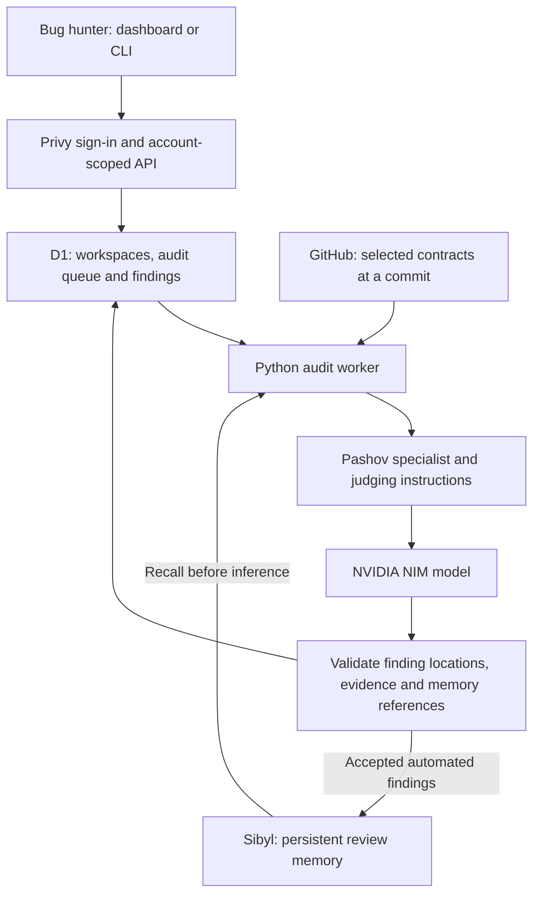

# SENTINEL

**Review smart contracts. Remember what you learned. Carry that knowledge into the next review.**

SENTINEL helps bug hunters review selected Solidity contracts from a public GitHub repository. Use the dashboard or CLI to manage the same account-private workspaces, inspect findings, and add your own notes.

[Open the dashboard](https://bugmind-cli.zedef0808.chatgpt.site) · [CLI source](bugmind/remote.py) · [Memory implementation](worker/core.py)

## Memory walkthrough — three lines for judges

**Persist:** Sibyl stores repository-scoped review outcomes: the finding, root cause, security invariant, contract/function, status, commit and source hashes; local human feedback also records the reason for a decision.  
**Recall:** A fresh process opens the same Sibyl database and repository tenant, retrieves `review_outcome` entities, checks their source hashes against the current files, and passes relevant memories into the reviewer before any model call.  
**Change:** Remembered invariants guide the next review, changed hashes mark old assumptions for revalidation, and a disabled or unreadable Sibyl store stops the review before inference—there is no stateless fallback.

This is implemented memory behavior, not a claim that every planned integration is complete. Automated worker findings are persisted to Sibyl. **Dashboard/hosted-CLI manual findings and decisions currently live in D1; their synchronization into Sibyl is still pending.** The complete human-feedback/recall loop is available through the local CLI commands below.

## Try it in the browser

1. Open [SENTINEL](https://bugmind-cli.zedef0808.chatgpt.site).
2. Sign in with **email or wallet** through Privy.
3. Choose **New workspace** and paste a public GitHub repository URL.
4. Select the `.sol` contracts to review, then choose **Create workspace & review**.
5. Open the workspace to follow progress, inspect returned findings, or add a manual finding.

A useful test repository is `https://github.com/crytic/not-so-smart-contracts`; select `reentrancy/Reentrancy.sol`. It contains intentionally vulnerable examples. A particular model run is not guaranteed to find every bug.

No LLM API key is required from hosted users. The operator supplies the NVIDIA credentials and runs the audit worker. If the worker is offline, a queued audit will not complete.

## Try it from the CLI

### 1. Install

You need **Python 3.11+, Git, and pipx**. If pipx is missing:

```sh
python -m pip install --user pipx
python -m pipx ensurepath
```

Open a new terminal, then install SENTINEL from this repository:

```sh
pipx install git+https://github.com/Oputasamuel/SENTINEL.git
sentinel --version
```

The command is `sentinel`; the Python package is named `sentinel-security-cli`. There is no PyPI release yet. To update an existing pipx installation, run `pipx upgrade sentinel-security-cli`.

### 2. Sign in

```sh
sentinel login
```

Your browser opens the Privy sign-in and CLI approval page. Approve only the code matching your terminal. SENTINEL stores the revocable CLI token in your OS credential store, never a plaintext configuration file. Tokens expire after 30 days.

### 3. Select the repository and contracts

```sh
sentinel workspace create https://github.com/crytic/not-so-smart-contracts
```

Enter the numbers of the contracts you want, separated by commas. This creates a **draft** workspace and selects it for subsequent commands. To skip the selection prompt:

```sh
sentinel workspace create https://github.com/crytic/not-so-smart-contracts --contracts reentrancy/Reentrancy.sol
```

### 4. Start the audit

```sh
sentinel audit --wait
```

The server performs the review; your terminal prints its status and dashboard link. You can close the terminal after the job is queued. `--wait` stops waiting after 10 minutes by default; it does not cancel the server job. Run `sentinel audit` later to check the status.

### 5. Read and manage findings

```sh
sentinel findings
sentinel findings show FINDING_ID
sentinel findings add
sentinel findings set-status FINDING_ID confirmed
```

Replace `FINDING_ID` with an ID printed by `sentinel findings`. The add command asks for a title, contract, severity, and evidence. Decisions support `open`, `confirmed`, `dismissed`, and `fixed`. These changes appear in the same dashboard workspace.

Useful commands:

| Command | What it does |
| --- | --- |
| `sentinel workspace list` | List your account's workspaces. |
| `sentinel workspace use WORKSPACE_ID` | Select an existing workspace. |
| `sentinel audit --workspace WORKSPACE_ID` | Start a draft audit or inspect its status. |
| `sentinel findings --workspace WORKSPACE_ID show FINDING_ID` | Read a finding in a specific workspace. |
| `sentinel logout` | Revoke this terminal's session. |
| `sentinel watch status` | Report monitoring availability; scheduled checks are not enabled yet. |

Current hosted limits: **8 selected contracts, 3 new workspaces per account per day, and one queued/running audit per account at a time**. The worker also caps selected source at 120 KB. It reviews selected contracts individually; this is not a whole-repository audit.

## How the parts work together



| Part | Role in SENTINEL | Current scope |
| --- | --- | --- |
| **Dashboard** | Repository selection, review progress, findings and manual decisions. | React/TypeScript with Vinext; hosted through Sites on Cloudflare Workers. |
| **CLI** | A terminal interface to the same workspaces and findings. | Python; browser device approval and OS key-store tokens. A separate local-review mode is also available. |
| **Privy** | Email/wallet sign-in and identity verification. | Server verifies Privy tokens and issues account sessions; CLI approval links a terminal to that account. |
| **GitHub** | Supplies the selected Solidity source. | Worker resolves the branch to a commit and fetches its selected files. Public repositories only. |
| **Pashov skills** | Provide the security review instructions. | Bundled `solidity-auditor`: 12 specialist passes, judging, then structured extraction. This is an API adaptation, not a review by the Pashov team. |
| **NVIDIA NIM** | Runs the model used by the hosted audit worker. | Operator-funded credentials; model is configurable with `NVIDIA_MODEL`. Hosted users do not supply keys. |
| **Sibyl** | Remembers findings and feedback across review processes. | Required `sibyl-memory-client==0.8.0`, using a local persistent database. Recall happens before inference. |
| **Cloudflare D1** | Stores accounts' CLI sessions, workspaces, findings and activity. | Application storage, separate from Sibyl's review memory. |
| **Base** | Intended verifiable audit receipts without publishing private evidence. | Receipt preparation/local verification and a Solidity registry contract exist. Automated onchain submission is not wired into the hosted audit path. |
| **Virtuals ACP** | Intended network for agents to request and deliver audit/recheck jobs. | The SYBIL agent has been configured in the Virtuals UI, but this repository does not execute ACP jobs or settlement. Registration alone is not a working job integration. |
| **Email and daily rechecks** | Intended updates when a review finishes, a possible fix needs approval, or a bug returns. | Planned. Scheduling and email delivery are not implemented; `watch enable` reports that explicitly. |

Pashov's upstream files are pinned to revision `c577eb7799c349de0acb187ba00ca98e14e436fd`, with the license and SHA-256 manifest in [bugmind/pashov_data](bugmind/pashov_data). A full successful run uses 14 model calls **per contract** in the hosted worker. This adapter does not autonomously execute exploit tests or search the entire repository.

The older local provider adapters remain available, including Gemini, OpenAI, OpenRouter, Anthropic, AgentRouter, and NVIDIA. They are not part of hosted users' setup. AgentRouter access was previously blocked; it is not the active hosted provider. Neither model availability nor free usage is guaranteed.

## Verify the memory behavior without an API key

Clone the source and install it into a virtual environment:

```sh
git clone https://github.com/Oputasamuel/SENTINEL.git
cd SENTINEL
python -m venv .venv
```

Activate it on Windows PowerShell:

```powershell
.\.venv\Scripts\Activate.ps1
```

Or on macOS/Linux:

```sh
source .venv/bin/activate
```

Then run:

```sh
python -m pip install -e .
python -m unittest tests.test_memory tests.test_cli -v
```

These tests demonstrate that:

- A finding saved in one Python process is recalled in a fresh process, while another repository gets no such memory.
- Changed source hashes invalidate the old rejection conditions.
- Confirmed invariants can be included when reviewing a sibling contract.
- Disabling Sibyl stops the model from being called; invented memory citations are rejected.

See [Memory and review gating](worker/core.py), [fresh-process and changed-source tests](tests/test_memory.py), and [cross-file recall test](tests/test_cli.py). An empty new database is allowed; SENTINEL requires a functioning memory store, not a pre-existing finding.

### Exercise the human-feedback loop locally

From your Solidity repository, after installing SENTINEL:

```sh
sentinel init
sentinel select provider
sentinel review contracts/Vault.sol --local-only
sentinel confirm REVIEW_ID FINDING_ID --reason "Only the owner may withdraw; this function lacks that check."
```

Replace the file path and IDs with your own. Close the terminal, reopen it in the same repository, then run:

```sh
sentinel memory
sentinel review contracts/Vault.sol --local-only
```

The second review reopens `.bugmind/memory.db` and receives the stored outcome. You can instead review a related contract to carry forward confirmed invariants. `reject` and `fixed` also record decisions with a required `--reason`.

For example, an old rejection may assume an upstream owner check exists. If the reviewed source changes, SENTINEL sets `conditions_unchanged=false` and tells the reviewer to recheck the evidence, rather than treating that old rejection as proof of safety. This changes review context; it does not guarantee a particular LLM verdict.

Local mode uses **your own** provider key and consumes its quota. Add `.bugmind/` to your repository's `.gitignore`. Keep the same project identity and persistent database to retain memory. Hosted workers use `.bugmind/workspaces/WORKSPACE_ID/memory.db`; creating another workspace creates a separate store.

## Run the audit worker yourself

This section is for operators. Hosted users can skip it.

1. Install the Python source as above.
2. Configure a dashboard with Privy and a D1 binding named `DB`.
3. Set the dashboard's server secrets: `PRIVY_APP_SECRET`, `SENTINEL_SESSION_SECRET`, and `SENTINEL_WORKER_TOKEN`; provide `NEXT_PUBLIC_PRIVY_APP_ID` when building the frontend. Register your dashboard origin in your Privy application.
4. Create an ignored `.env` in the repository root:

```dotenv
SENTINEL_DASHBOARD=https://your-dashboard.example
SENTINEL_WORKER_TOKEN=replace-with-the-same-random-secret-used-by-the-dashboard
NVIDIA_API_KEY=replace-with-your-operator-key
NVIDIA_MODEL=replace-with-an-accessible-NVIDIA-model-id
```

Use a random worker token of at least 32 characters. Keep secrets out of Git. The worker runs under the operator's provider account and must retain its `.bugmind/` directory on persistent storage.

```sh
python -m worker.dashboard_worker
```

Leave this service running to process queued audits. It currently polls for audit jobs; it does **not** run scheduled daily rechecks. A queued status alone does not prove that a worker is online. Audit artifacts may contain private source and review evidence.

### Dashboard development

Requires Node.js 22.13+ and npm. Configure the Privy values above in an ignored `dashboard/.env.local`; server runtime secrets must also be available to the hosting environment. Sign-in requires a real Privy configuration; it is not simulated.

```sh
cd dashboard
npm ci
npm run build
npx wrangler d1 execute DB --local --file=drizzle/0000_equal_nighthawk.sql --persist-to=.wrangler/state --config dist/server/wrangler.json
npm run dev
```

Open `http://localhost:5173`. `.openai/hosting.json` identifies this project's existing Sites deployment; a fork must provision its own hosting project and database instead of reusing that ID. Local D1 data and the deployed database are separate.

## Repository map

| Path | Contents |
| --- | --- |
| `dashboard/app/` | Pages, Privy login, CLI approval and workspace APIs. |
| `dashboard/db/`, `dashboard/drizzle/` | D1 binding and initial database migration. |
| `bugmind/remote.py`, `bugmind/cloud.py` | Hosted CLI commands and authenticated requests. |
| `bugmind/cli.py`, `bugmind/project.py` | CLI entry point and local Solidity-file loading. |
| `bugmind/pashov.py`, `bugmind/pashov_data/` | Review orchestration and pinned upstream skills. |
| `bugmind/providers.py`, `bugmind/settings.py` | Model adapters, settings and OS key-store access. |
| `worker/core.py` | Sibyl persistence/recall, context checks and finding validation. |
| `worker/dashboard_worker.py` | GitHub intake and hosted audit-job processing. |
| `worker/server.py` | Legacy loopback worker for earlier fixtures and tests. |
| `bugmind/base.py`, `contracts/` | Local Base receipt utilities and registry contract source. |
| `tests/`, `dashboard/tests/` | Memory, CLI, provider and authentication checks. |
| `fixtures/` | Before/after Solidity examples for deterministic tests. |
| `docs/` | Design records and earlier integration notes; dates and planned items matter. |

## Boundaries and current limitations

- Private workspaces are scoped to the signed-in account. CLI credentials use the OS key store. A suitable key-store backend is required on Linux/headless machines.
- Hosted source passes through the operator's worker and NVIDIA. Local reviews send source to the chosen provider; optional legacy `sync` uploads only review summaries.
- Manual dashboard findings are saved in D1 but are not yet written back to Sibyl. Status decisions do not automatically verify that a vulnerability is fixed.
- The worker reviews selected contracts individually and can finish a workspace when at least one selected contract succeeds. A completed workspace is not proof that every contract was successfully reviewed.
- Daily rechecks, email delivery, automatic Base transactions and executable Virtuals ACP jobs remain integration work. If both Virtuals agents are operated by SENTINEL, that relationship must be disclosed.
- Findings require human verification. An empty result is not a security certificate, and SENTINEL is not a formal audit by Pashov.

## Tests

From the repository root with the Python environment active:

```sh
python -m unittest discover -s tests -v
```

For the dashboard:

```sh
cd dashboard
node --test tests/session-route.test.cjs tests/workspace-cli.test.cjs
npm run build
```

Automated tests use fixtures/mocks where appropriate; they do not prove live provider, payment, email, or ACP execution. The browser smoke-test scripts are for a configured local test environment and should not be pointed at production.

## License

MIT. The bundled Pashov skills retain their [upstream MIT license](bugmind/pashov_data/LICENSE).
